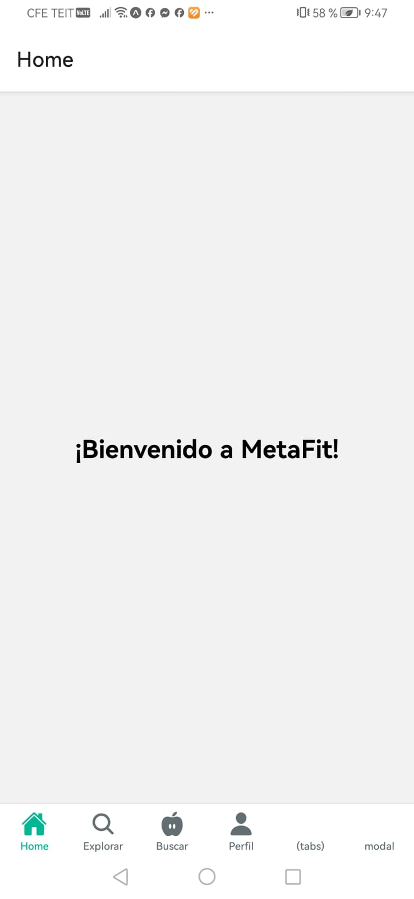
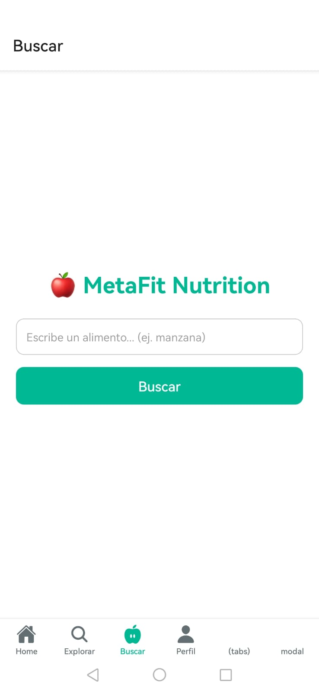

# Welcome to your Expo app 👋
# **MetaFit**

## **1. Identificación del Proyecto**
**Nombre de la Aplicación:** MetaFit  
**Asignatura:** Desarrollo de Aplicaciones Móviles  
**Profesor:** M.C. Leonel González Vidales  
**Periodo:** Agosto - Diciembre 2025  
**URL del Repositorio:** [https://github.com/yakshuri-varona/MetaFit](https://github.com/yakshuri-varona/MetaFit)

---

## **2. Descripción del Proyecto**
**MetaFit** es una aplicación móvil diseñada para ayudar a los usuarios a conocer la información nutricional de diversos alimentos, frutas o golosinas.  
Su principal funcionalidad consiste en permitir la búsqueda por nombre de alimento y mostrar sus calorías, carbohidratos, proteínas y grasas.  

### **Características principales:**
- Búsqueda rápida y precisa de alimentos.  
- Información nutricional detallada.  
- Interfaz amigable con navegación intuitiva (Home, Explorar y Perfil).  
- Optimización para dispositivos Android mediante **Expo**.  

---

## **3. Tecnologías y Versiones Utilizadas**

### **Stack Tecnológico:**
- **React Native** con **Expo**
- **Node.js**  
- **JavaScript (ES6+)**  
- **API Ninjas Nutrition** (para datos nutricionales)

### **Herramientas de Desarrollo:**
- Visual Studio Code  
- Git y GitHub  
- Expo Go (para pruebas móviles)

### **Verificación del Entorno:**
- Node.js versión 18 o superior  
- Expo CLI instalado globalmente  
- Conexión a internet para consumir la API

---

## **4. Estructura del Proyecto**

### **Organización de Archivos:**
MetaFit/
│
├── app/ # Rutas principales de la app
│ ├── _layout.js
│ ├── index.js # Pantalla principal (Home)
│ ├── explore.js # Pantalla de búsqueda y resultados
│ └── profile.js # Pantalla de perfil del usuario
│
├── assets/ # Iconos e imágenes internas
├── components/ # Componentes reutilizables
├── screenshots/ # Capturas para el README
│ ├── pantalla_principal.png
│ ├── pantalla_busqueda.png
│ ├── extra_1.png
│ └── extra_2.png
│
├── App.js
├── package.json
└── README.md

---


### **Arquitectura:**
La aplicación sigue una arquitectura modular basada en componentes de React Native, con navegación mediante `expo-router` y consumo de datos desde la API.

---

## **5. Instalación y Configuración**

### **Instalación de Dependencias:**
```bash
npm install

---

### **Dependencias Del Proyecto:**

-expo
-react
-eact-native
-expo-router
---
### **Verificación del Entorno:**
node -v
npm -v
expo --version

 ---

This is an [Expo](https://expo.dev) project created with [`create-expo-app`](https://www.npmjs.com/package/create-expo-app).

## Get started

1. Install dependencies

   ```bash
   npm install
   ```

2. Start the app

   ```bash
   npx expo start
   ```
   ---

## **6. Ejecución de la Aplicación**
## **Scripts Disponibles:**
npx expo start

---

## **Primera Ejecución:**

Abre una terminal en la carpeta del proyecto.

Ejecuta npx expo start.

Escanea el código QR desde la app Expo Go en tu celular.

## **Notas de Entorno:**

Si ocurre un error con package.json, asegúrate de estar en la carpeta raíz del proyecto antes de ejecutar Expo.

## **7. Funcionalidades dentro de la Aplicación:**
---
## **Pantalla principal:**
La pantalla principal muestra el nombre de la aplicación, el campo de búsqueda y las opciones de navegación.



---

## **Pantalla de busqueda:**

En esta pantalla, el usuario puede escribir el nombre de una fruta, alimento o golosina para obtener información nutricional detallada (calorías, proteínas, carbohidratos, grasas, etc.).



## **Datos de Ejemplo:**

Manzana 🍎
Banana 🍌
Chocolate 🍫

Características técnicas

Peticiones HTTP con fetch API.

Integración directa con API Ninjas Nutrition.

Renderizado dinámico de los resultados.

Manejo de errores y respuestas nulas.

8. Desarrollo y Extensión
Próximas funcionalidades sugeridas:

Agregar más alimentos y categorías.

Integrar recetas saludables relacionadas con cada alimento.

Mostrar calorías totales según la cantidad del alimento.

Estructura para nuevas pantallas:

Se planea crear un archivo adicional dentro de app/recipes.js y una nueva ruta /recipes para mostrar las recetas recomendadas según el alimento buscado.


In the output, you'll find options to open the app in a

- [development build](https://docs.expo.dev/develop/development-builds/introduction/)
- [Android emulator](https://docs.expo.dev/workflow/android-studio-emulator/)
- [iOS simulator](https://docs.expo.dev/workflow/ios-simulator/)
- [Expo Go](https://expo.dev/go), a limited sandbox for trying out app development with Expo

You can start developing by editing the files inside the **app** directory. This project uses [file-based routing](https://docs.expo.dev/router/introduction).

## Get a fresh project

When you're ready, run:

```bash
npm run reset-project
```

This command will move the starter code to the **app-example** directory and create a blank **app** directory where you can start developing.

## Learn more

To learn more about developing your project with Expo, look at the following resources:

- [Expo documentation](https://docs.expo.dev/): Learn fundamentals, or go into advanced topics with our [guides](https://docs.expo.dev/guides).
- [Learn Expo tutorial](https://docs.expo.dev/tutorial/introduction/): Follow a step-by-step tutorial where you'll create a project that runs on Android, iOS, and the web.

## Join the community

Join our community of developers creating universal apps.

- [Expo on GitHub](https://github.com/expo/expo): View our open source platform and contribute.
- [Discord community](https://chat.expo.dev): Chat with Expo users and ask questions.
